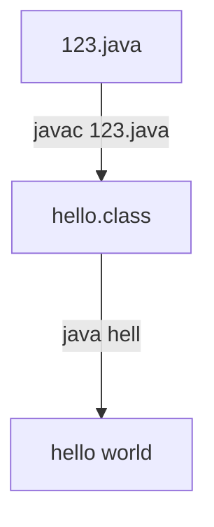

# 基础介绍

## 开发环境安装

[下载地址](http://www.oracle.com/technetwork/java/javase/downloads/java-archive-downloads-javase7-521261.html)

## Hello world

### 注意点

* 安装路径不要有空格，全英文
* 安装完成后会提示安装jre，取消
* 完成sublime text编译java的配置。写出第一个hello world 程序。

### 课程tips:

1. 如果使用

   ```java
   public class Hello{
        ...
   }
   ```

   则文件名与类名要相同。

2. windows里覆盖保存文件名大小写不敏感。如hello world覆盖Hello World保存后仍为Hello World

### 运行过程




### 环境变量

`PATH`：Java开发工具的位置，如D:\jdk1.8.0\bin

`CLASSPATH`[^1]：JVM寻找字节码文件的位置

[^1]: 系统用户环境变量`CLASSPATH`添加class文件路径后，添加的路径覆盖当前路径。若要优先使用当前路径，配置为`CLASSPATH=.;E:\test`。

## 语法

### 基本语法

  1. 严格大小写

  2. 一个源文件只能一个 `public` 类，可有其余多个类。编译完每个类生成一个 `class` 文件

  3. 若一个类必须运行，则必须拥有 `main` 方法。因为 `main` 方法是程序的入口。

###三大注释

```java
  //单行注释

  /*多行注释*/

  /** 文档注释 可以生成api文档*/
```

### 关键字和保留字

**关键字**：事先定义的有特殊用途的单词

**保留字**：事先定义，暂时没功能

### 分隔符

```java
; //一句话结束

{ } //代码块

[ ] //数组

( ) //很多用

. //访问类、对象成员

  //空格
```

### 标识符

定义：增强阅读性自定义的字母（中文或日语）、数字、下划线、`$`组成，不能以数字开头

**注意点：**
1. 大小写敏感
2. 不能用关键字和保留字
3. 不能用Java API中的类名作为自己的类名

>Tips: 类名首字母规范大写

* Editplus 工具


